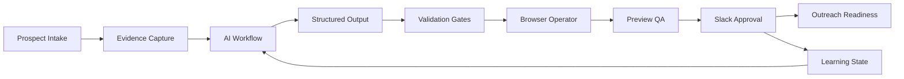

# Agency OS Architecture

Agency OS is a proprietary autonomous AI operations platform. This document explains the public-safe architecture and interview talking points without exposing production prompts, customer data, account details, or business-specific implementation logic.

## Purpose

Agency OS is designed to autonomously manage business operations while minimizing manual intervention through AI-assisted decision making, workflow orchestration, browser automation, runtime monitoring, and human approval gates.

## High-Level Flow

## Core Components

| Component | Responsibility | Public-Safe Notes |
| --- | --- | --- |
| Prospect intake | Collect target context and business evidence | No real prospects or client data included |
| AI workflow | Generate structured recommendations and customer-facing assets | Production prompts remain private |
| Browser operator | Execute browser-based tasks and capture evidence | Account/session details remain private |
| Preview QA | Validate generated outputs before approval | Safety gates are described at pattern level |
| Approval routing | Send decisions to a human before external action | Slack workflow is described without tokens |
| Learning state | Persist outcomes for future improvements | Outcome schema is genericized |

## Engineering Decisions

- Use structured JSON artifacts so every stage has a machine-readable contract.
- Keep human approval gates before outreach, publishing, DNS, payments, or customer-visible actions.
- Separate generated runtime artifacts from source-controlled code.
- Use runtime supervision so local automation can be monitored and recovered.
- Treat browser automation as an unreliable runtime that needs evidence capture and failure classification.

## Interview Talking Points

- Why autonomous workflows need explicit state management.
- How approval gates reduce risk in AI-driven business processes.
- How browser automation changes reliability requirements.
- How to protect proprietary business IP while still demonstrating engineering depth.

