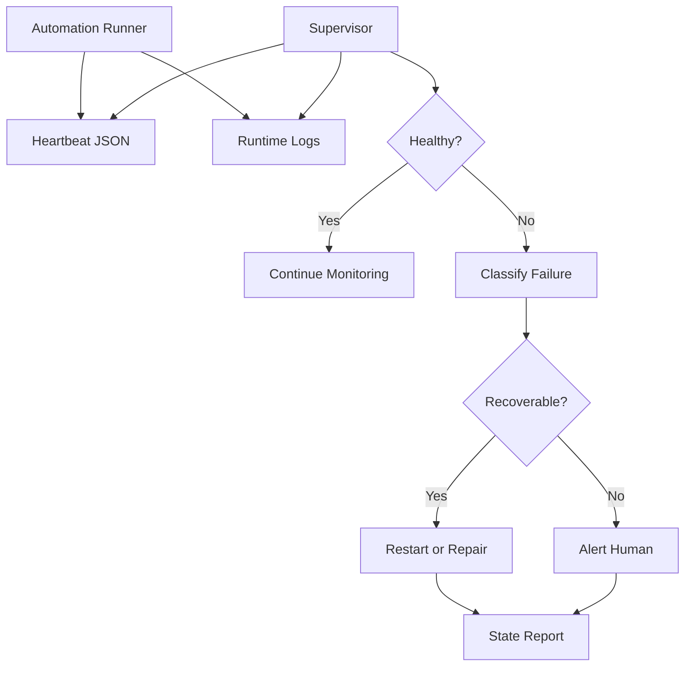

# Runtime Supervisor Architecture

The runtime supervisor is a production reliability layer for long-running AI and browser automation. It monitors runner health, detects stale state, classifies failure modes, and coordinates recovery or alerting.

## Problem

Long-running automation can fail silently:

- Browser sessions can stall.
- Local runners can die.
- Heartbeats can stop updating.
- OneDrive or Windows file writes can be temporarily locked.
- A task can appear active while making no progress.

The supervisor exists so automation has an external source of truth.

## High-Level Flow



## Heartbeat Contract

```json
{
  "runner_id": "local-runner",
  "status": "running",
  "last_seen_utc": "2026-06-26T16:00:00Z",
  "active_task": "preview_generation",
  "attempt": 2,
  "last_error": null,
  "recovery_action": null
}
```

## Failure Classes

| Class | Signal | Response |
| --- | --- | --- |
| Stale heartbeat | `last_seen_utc` exceeds threshold | Restart runner or alert |
| Browser stall | No browser progress or screenshot update | Recover tab/session |
| Locked artifact | File write fails transiently | Retry with backoff |
| Capacity blocked | External tool cannot accept new work | Hold and retry later |
| Unknown failure | Unclassified exception or missing state | Alert with logs |

## Engineering Decisions

- Heartbeat files are simple, inspectable, and resilient.
- Recovery is separated from detection so failure policy can evolve.
- Logs and state snapshots are treated as operational evidence.
- Alerts should tell the operator what is true, not just that something failed.

## Interview Talking Points

- Why runtime supervision matters for AI/browser automation.
- How to design a heartbeat schema.
- How to classify failures without overfitting to one tool.
- How to balance automatic recovery with human escalation.

