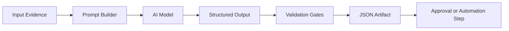

# AI Workflow Examples

Public-safe examples of structured AI workflows for production automation.

This repository demonstrates how an AI workflow can transform evidence into structured outputs, validate those outputs, and produce downstream artifacts without exposing proprietary Agency OS business logic.

## What This Demonstrates

- OpenAI-style structured output contracts
- Prompt and response separation
- Validation gates
- Evidence-backed generation
- Learning-event capture
- JSON artifacts for downstream automation

## Architecture



## Example Output Contract

```json
{
  "business_name": "Example Roofing",
  "observed_issue": "Website lacks clear service-area messaging",
  "recommended_action": "Generate a homepage concept emphasizing trust, speed, and emergency availability",
  "confidence": 0.86,
  "requires_review": true
}
```

## Example Code

- `src/build_prompt_contract.py` builds a public-safe prompt/output contract from evidence.
- `src/validate_output.py` validates structured JSON outputs before downstream automation.
- `examples/sample_output.json` shows a sanitized example artifact.

## Engineering Notes

The key idea is not simply calling an AI API. The engineering value is in the contract around the model:

- Input evidence is explicit.
- Output shape is predictable.
- Validation can reject unsafe or low-quality generations.
- Human approval can be routed before external actions.
- Learning events can improve future runs.

## Public Safety

This repository intentionally excludes:

- Production prompts
- Customer data
- Proprietary Agency OS logic
- Credentials
- Private webhook URLs
