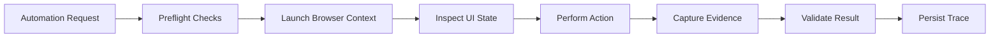

# Browser Automation

Public-safe examples for browser automation, evidence capture, and UI state inspection.

This repository demonstrates browser automation architecture without including proprietary Agency OS prompts, workflows, customer targets, or production accounts.

## What This Demonstrates

- Playwright/Chrome automation flow
- Browser state inspection
- Screenshot evidence capture
- Action tracing
- Capacity or preflight checks
- Recovery from common UI failures

## Architecture

## Example Flow

See `examples/evidence_capture_flow.md`.

## Engineering Notes

Browser automation becomes production-grade when it treats the browser as an unreliable runtime:

- Verify identity before taking action.
- Check capacity and state before generating expensive work.
- Capture screenshots and traces for debugging.
- Classify failures instead of retrying blindly.
- Prefer recovery paths before creating duplicate work.

## Public Safety

This repository should not include real account credentials, real target sites, production prompts, customer screenshots, or proprietary business rules.

