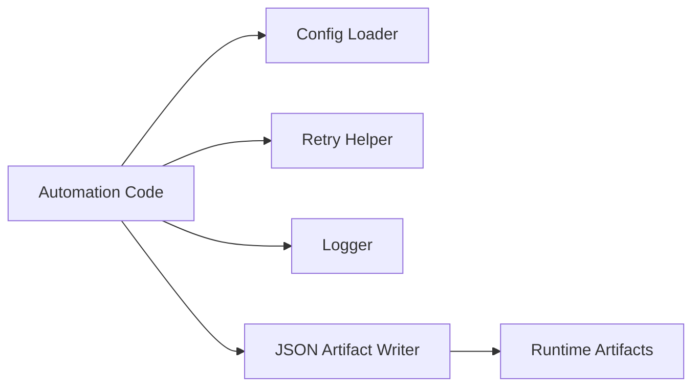

# Engineering Utilities

Small reliability utilities for automation-heavy Python projects.

This repository demonstrates reusable patterns for logging, retries, config loading, and JSON artifact handling.

## What This Demonstrates

- Retry wrappers
- Structured logging
- Defensive JSON reads/writes
- Config management
- Runtime artifact separation

## Architecture

## Engineering Notes

Automation systems fail in ordinary ways: transient network errors, locked files, partial writes, stale state, and missing configuration. Small utilities make the rest of the system more reliable and easier to reason about.

## Public Safety

Keep this repository generic. Do not include production configs, secrets, customer data, private endpoints, or proprietary Agency OS modules.

