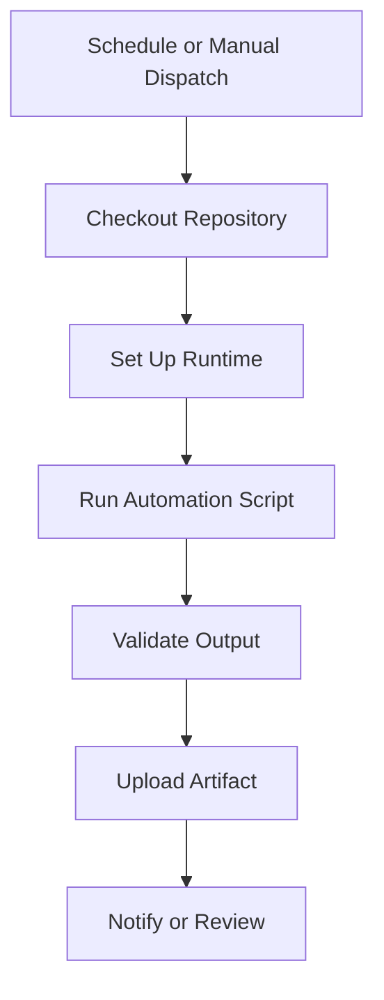

# GitHub Actions Automation

Public-safe examples of scheduled automation and workflow dispatch patterns.

This repository demonstrates how GitHub Actions can orchestrate repeatable jobs, state refreshes, and report generation without exposing production Agency OS logic.

## What This Demonstrates

- Scheduled workflows
- Manual workflow dispatch
- Python automation entrypoints
- JSON artifact generation
- CI-style validation
- Notification-ready outputs

## Architecture

## Example Workflow

See `.github/workflows/scheduled-automation.yml`.

## Engineering Notes

GitHub Actions is useful as a lightweight orchestration layer when the job needs:

- A schedule
- Reproducible execution
- Clear logs
- Manual dispatch
- Artifact persistence
- A safe boundary around automation

## Public Safety

Use GitHub Secrets for credentials. Do not commit API keys, webhook URLs, Slack tokens, production state files, or customer data.

