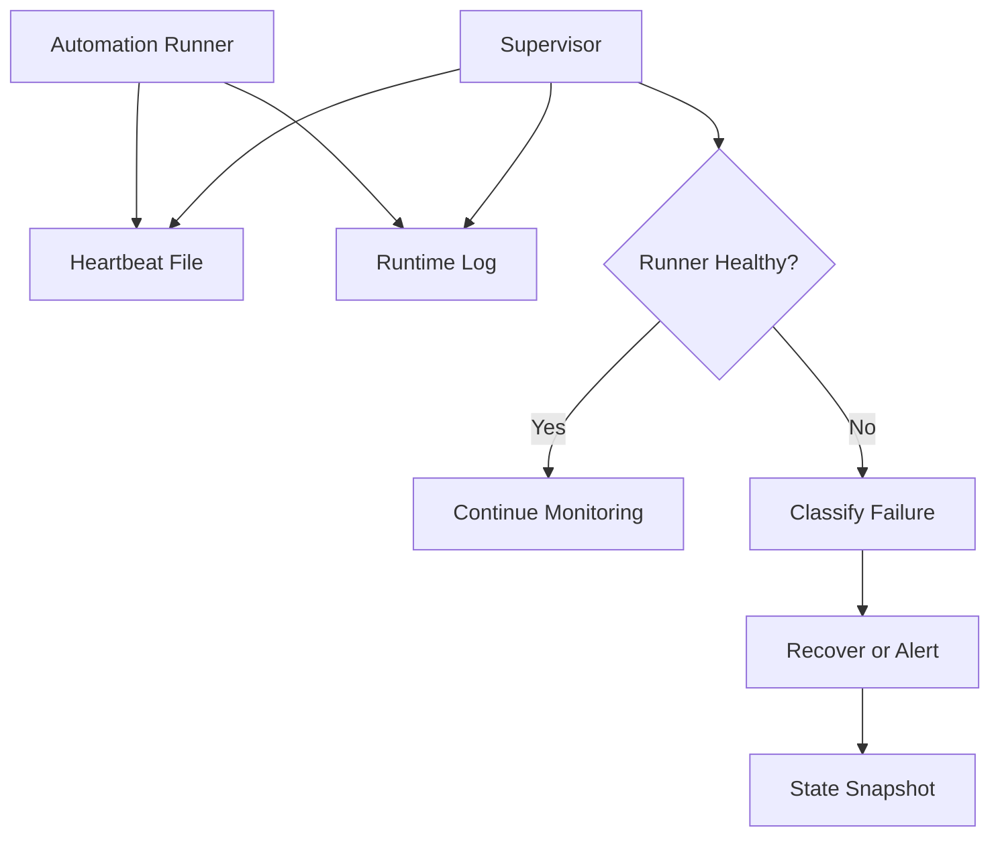

# Runtime Supervisor

Public-safe runtime supervision patterns for long-running local automation.

This repository demonstrates heartbeat monitoring, stale-state detection, recovery decisions, and operational logging for automation runners.

## What This Demonstrates

- JSON heartbeat files
- Runtime state snapshots
- Stale-runner detection
- Recovery decision logic
- Process-health reporting
- Supervisor-to-notification bridge

## Architecture

## Heartbeat Schema

See `schemas/heartbeat.schema.json` for a minimal runtime state contract.

## Engineering Notes

Long-running automation needs a source of truth outside the process itself. A heartbeat file gives the supervisor a simple way to answer:

- Is the runner alive?
- When did it last make progress?
- What task was active?
- What recovery action was attempted?
- Should a human be notified?

## Public Safety

This repo is intentionally generic and excludes production Agency OS runner code, Slack webhooks, service names, account IDs, and customer data.

